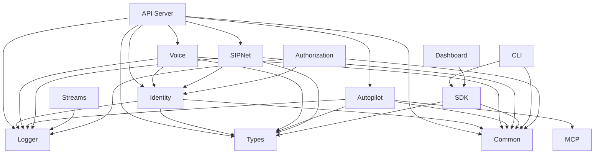

# Fonoster 核心模块文档

本目录包含 Fonoster 项目所有核心模块的详细文档。

## 模块概览

### 核心服务模块

| 模块 | 描述 | 文档链接 |
|------|------|----------|
| [API Server](./apiserver.md) | 核心 API 服务器，提供统一的 gRPC 和 HTTP 接口 | [详细文档](./apiserver.md) |
| [Identity](./identity.md) | 身份认证和授权服务，支持 JWT 和 OAuth2 | [详细文档](./identity.md) |
| [Voice](./voice.md) | 语音应用服务器，处理通话流程和语音指令 | [详细文档](./voice.md) |
| [Autopilot](./autopilot.md) | AI 驱动的智能助手，支持对话和知识库 | [详细文档](./autopilot.md) |

### 网络和通信模块

| 模块 | 描述 | 文档链接 |
|------|------|----------|
| [SIPNet](./sipnet.md) | SIP 网络栈，基于 Routr 的 SIP 协议处理 | [详细文档](./sipnet.md) |
| [Streams](./streams.md) | 音频流处理，支持实时音频传输 | [详细文档](./streams.md) |
| [Authorization](./authz.md) | 授权服务，提供细粒度的权限控制 | [详细文档](./authz.md) |

### 工具和SDK模块

| 模块 | 描述 | 文档链接 |
|------|------|----------|
| [SDK](./sdk.md) | Web 和 Node.js 开发工具包 | [详细文档](./sdk.md) |
| [CLI Tool](./ctl.md) | 命令行管理工具 | [详细文档](./ctl.md) |
| [Dashboard](./dashboard.md) | Web 管理界面 | [详细文档](./dashboard.md) |

### 支撑模块

| 模块 | 描述 | 文档链接 |
|------|------|----------|
| [Common](./common.md) | 公共库和工具函数 | [详细文档](./common.md) |
| [Types](./types.md) | TypeScript 类型定义 | [详细文档](./types.md) |
| [Logger](./logger.md) | 统一日志服务 | [详细文档](./logger.md) |
| [MCP](./mcp.md) | 模型上下文协议，AI 模型集成 | [详细文档](./mcp.md) |

## 模块依赖关系



## 开发指南

### 模块开发规范

1. **目录结构**
   ```
   mods/[module-name]/
   ├── src/           # 源代码
   ├── test/          # 测试文件
   ├── package.json   # 模块配置
   ├── tsconfig.json  # TypeScript 配置
   └── README.md      # 模块说明
   ```

2. **命名规范**
   - 模块名使用小写字母和连字符
   - 文件名使用 camelCase
   - 类名使用 PascalCase
   - 常量使用 UPPER_SNAKE_CASE

3. **依赖管理**
   - 使用 Lerna 管理 monorepo
   - 共享依赖放在根目录
   - 模块特定依赖放在各自的 package.json

### 构建和测试

```bash
# 构建所有模块
npm run build

# 运行测试
npm test

# 清理构建产物
npm run clean
```

### 添加新模块

1. 在 `mods/` 目录下创建新模块目录
2. 添加 `package.json` 和 `tsconfig.json`
3. 在根目录的 `package.json` 中添加 workspace
4. 更新 Lerna 配置
5. 添加模块文档

## 故障排除

### 常见问题

1. **模块依赖问题**
   - 检查 package.json 中的依赖版本
   - 运行 `npm install` 重新安装依赖

2. **TypeScript 编译错误**
   - 检查 tsconfig.json 配置
   - 确保类型定义正确

3. **模块间通信问题**
   - 检查 gRPC 服务配置
   - 验证网络连接

更多详细信息请参考各个模块的具体文档。