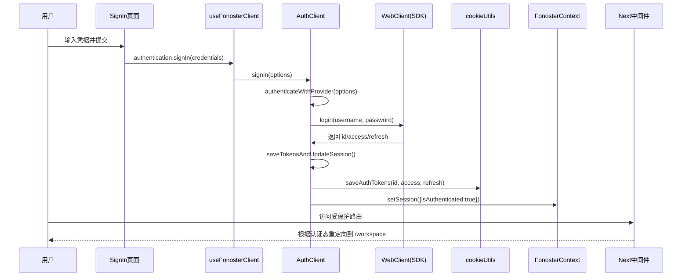
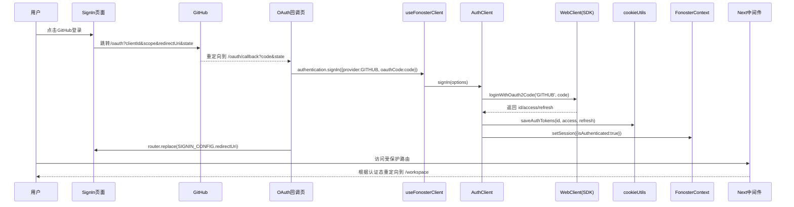
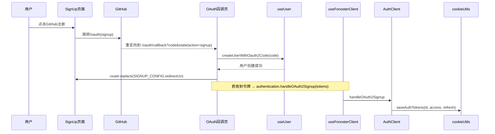
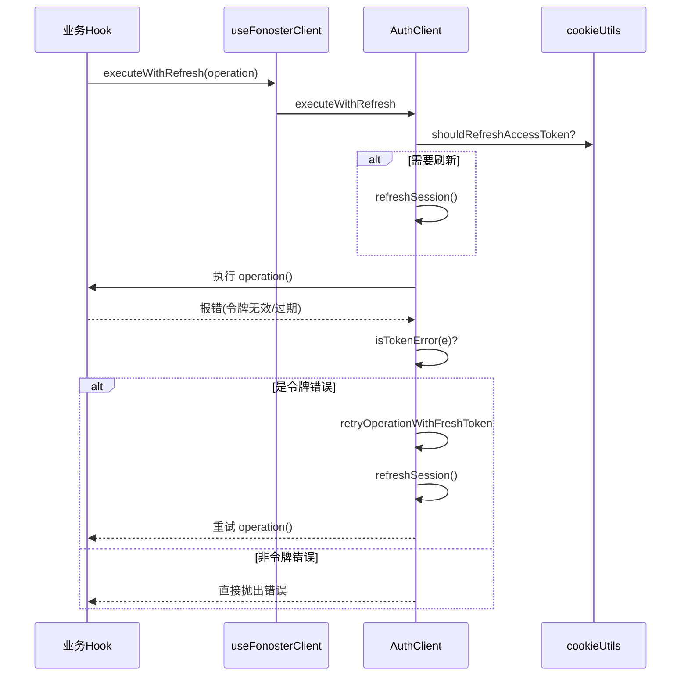
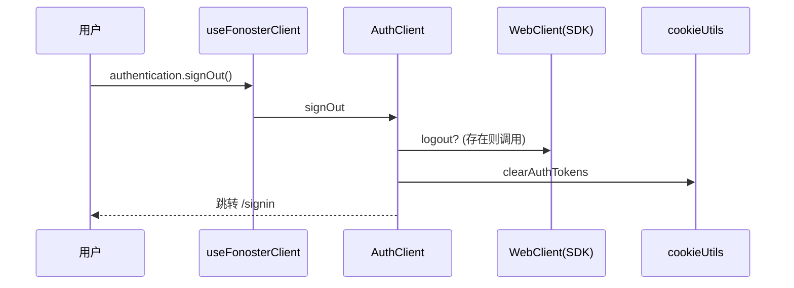

# 认证、OAuth、Cookie 与中间件

核心组件与文件：
- 中间件：`src/middleware.ts`
- 认证客户端：`src/common/sdk/auth/AuthClient.ts`
- Cookie 工具：`src/common/utils/cookieUtils.ts`
- JWT 工具：`src/common/utils/tokenUtils.ts`
- OAuth 配置与类型：`src/config/oauth.ts`、`src/types/oauth.ts`
- OAuth 回调页：`src/pages/oauth/callback.tsx`

路由访问控制（中间件）：
- 忽略静态与 API 路径；其余路径强制检查 `refreshToken`。
- 未认证：非公共路径统一重定向到 `/signin`。
- 已认证：若 `idToken` 中 `emailVerified/phoneNumberVerified` 为 false，则重定向到 `/signup/verify`。
- 根路径：根据认证态重定向至 `/workspace` 或 `/signin`。

令牌与 Cookie：
- Cookie 名称：`idToken`、`accessToken`、`refreshToken`。
- 保存策略：`cookieUtils.saveAuthTokens()` 统一设置（`secure` 生产启用、`sameSite=lax`）。
- 清理策略：`cookieUtils.clearAuthTokens()` 在登出或错误态清理。
- 刷新判断：`cookieUtils.shouldRefreshAccessToken()` → `tokenUtils.shouldRefreshToken(accessToken)`。

JWT 工具关键逻辑：
- `isTokenExpired(token)`：过期或非法返回 true。
- `shouldRefreshToken(token, thresholdMinutes=5)`：距离过期阈值内返回 true。
- `decodeToken(token)`：解析并返回 `exp/sub/...`；异常返回 null。

认证客户端（主要流程）：
- `signIn(options)`：按 `AuthProvider` 分派到 `client.login()` 或 `client.loginWithOauth2Code()`；成功后 `saveTokensAndUpdateSession()`。
- `signUp(options)`：复用 `signIn`（支持 OAuth 注册）。
- `signOut()`：调用 SDK `logout()`（若存在），清理 Cookie，回调 `onSignOut()`，并跳转 `/signin`。
- `refreshSession()`：在需要刷新时请求服务端刷新，失败则 `handleAuthError()`（清 Cookie 并登出）。
- `executeWithRefresh(operation)`：在执行前后判断刷新需求，遇到令牌错误时尝试刷新并重试。
- `handleOAuth2Signup(tokens)`：用于前端直拿到 OAuth2 令牌的场景，写入 Client 与 Cookie，并置为已认证。

OAuth（以 GitHub 为例）：
- 配置来源：`src/config/oauth.ts` 读取环境变量，分别配置 `signin` 与 `signup` 的 `redirectUri/scope`。
- 发起：`/signin` 与 `/signup` 页面生成 `state`（含 `provider` 与 `action`），跳转至 `authUrl`。
- 回调：`/oauth/callback` 解析 `code` 与 `state`，根据 `action`：
  - `signin`：调用 `authentication.signIn({ provider: GITHUB, oauthCode: code })`，完成后跳转 `signin` 的 `redirectUri`。
  - `signup`：调用 `createUserWithOauth2Code(code)` 完成注册，跳转 `signup` 的 `redirectUri`。

实例：凭据登录
- 入口：`src/pages/signin/index.tsx`
- 表单校验：`zod` + `react-hook-form`
- 提交：`authentication.signIn({ provider: credentials, credentials: { username, password } })`
- 成功：中间件检测到认证态后进入工作区路由。

实例：OAuth 登录
- 入口：`src/pages/signin/index.tsx` → GitHub 按钮
- 回调处理：`src/pages/oauth/callback.tsx`，完成后跳转至 `OAUTH_CONFIG.signin.redirectUri`

安全建议：
- 生产环境启用 `secure` Cookie；`sameSite=lax` 保持重定向兼容。
- 避免将敏感信息存入 `idToken`，仅用于 UI 状态（邮箱/手机号验证）。

## 时序图与函数级调用序列

下文将从“凭据登录”“OAuth 登录/注册”“令牌刷新包装器”“登出”四条主线，对实现进行逐步分解，并提供 Mermaid 时序图与函数级调用序列，便于开发与排查。

### 凭据登录（Credentials）分步说明
- 输入校验：`signin/index.tsx` 使用 `react-hook-form + zod` 校验用户名和密码。
- 发起调用：`useFonosterClient().authentication.signIn({ provider: credentials, credentials })`。
- Provider 分派：`AuthClient.authenticateWithProvider` 根据 `provider` 路由到 `client.login(username, password)`。
- SDK 调用：扩展的 `WebClient` 执行后端认证，返回 `id/access/refresh` 令牌。
- 令牌收集：`AuthClient.saveTokensAndUpdateSession()` 通过 `getIdToken/getAccessToken/getRefreshToken`（或对象属性回退）取得令牌。
- Cookie 写入：`cookieUtils.saveAuthTokens(idToken, accessToken, refreshToken)`（`secure` 生产启用、`sameSite=lax`、`path=/`）。
- 会话更新：`setSession({ isAuthenticated: true })`，由 `FonosterContext` 下发到全局。
- 路由保护：中间件 `middleware.ts` 基于 `refreshToken` 的有效性判断认证态；根路径 `/` 重定向到 `/workspace`。
- 验证门槛：若 `idToken.emailVerified/phoneNumberVerified` 为 false，则强制 `/signup/verify`。

函数级调用序列（凭据登录）：
- `pages/signin/index.tsx` → `useFonosterClient.authentication.signIn`
- `AuthClient.signIn` → `AuthClient.authenticateWithProvider`
- `WebClient.login` → `AuthClient.saveTokensAndUpdateSession`
- `cookieUtils.saveAuthTokens` → `FonosterContext.setSession`
- `middleware.ts` 根据 Cookie 决定重定向

### OAuth 登录（以 GitHub 为例）分步说明
- 发起阶段：`signin/index.tsx` 生成 `state={ provider:GITHUB, action:'signin', nonce }` 并跳转 `OAUTH_CONFIG.signin.authUrl`。
- 回调解析：`oauth/callback.tsx` 解析 `query.code/state` → 得到 `{code, provider, action}`。
- 认证调用：`action==='signin'` 时，执行 `authentication.signIn({ provider:GITHUB, oauthCode:code })`。
- Provider 分派：`AuthClient.authenticateWithProvider` → `client.loginWithOauth2Code('GITHUB', code)`。
- 令牌与会话：同凭据登录，写 Cookie 并置 `session.isAuthenticated=true`。
- 重定向：完成后 `router.replace(SIGNIN_CONFIG.redirectUri)`（来自 `pages/signin` 导出的 `GITHUB_CONFIG`）。

函数级调用序列（OAuth 登录）：
- `pages/signin/index.tsx` → 跳转 Provider → `pages/oauth/callback.tsx`
- `useFonosterClient.authentication.signIn` → `AuthClient.signIn`
- `AuthClient.authenticateWithProvider` → `WebClient.loginWithOauth2Code`
- `AuthClient.saveTokensAndUpdateSession` → `cookieUtils.saveAuthTokens` → `FonosterContext.setSession`

### OAuth 注册（Signup）分步说明
- 发起阶段：`signup/index.tsx` 生成 `state={ provider:GITHUB, action:'signup' }` 并跳转 `OAUTH_CONFIG.signup.authUrl`。
- 回调解析：`oauth/callback.tsx` → `action==='signup'` 时执行 `useUser().createUserWithOauth2Code(code)`。
- 完成重定向：`router.replace(SIGNUP_CONFIG.redirectUri)`。
- 若后端在回调阶段直接返回令牌：调用 `authentication.handleOAuth2Signup({ idToken, accessToken, refreshToken })` 写入 Client 与 Cookie 并置已认证。

函数级调用序列（OAuth 注册）：
- `pages/signup/index.tsx` → Provider → `pages/oauth/callback.tsx`
- `useUser.createUserWithOauth2Code`
- 可选：`useFonosterClient.authentication.handleOAuth2Signup` → `AuthClient.handleOAuth2Signup` → `cookieUtils.saveAuthTokens`

### 令牌刷新与错误重试分步说明
- 包装器入口：`useFonosterClient.authentication.executeWithRefresh(operation)`。
- 刷新判断：若 `cookieUtils.shouldRefreshAccessToken()` 为 true，则先 `AuthClient.refreshSession()`。
- 执行操作：调用 `operation()`（如资源查询）。
- 错误识别：`AuthClient.isTokenError(e)` 检测是否包含 `"token expired"/"invalid token"`。
- 重试机制：`AuthClient.retryOperationWithFreshToken()` → 先刷新再重试。
- 刷新失败：`AuthClient.handleAuthError()` 清 Cookie 与会话并触发登出。

函数级调用序列（刷新包装器）：
- `useFonosterClient.authentication.executeWithRefresh` → `AuthClient.executeWithRefresh`
- `cookieUtils.shouldRefreshAccessToken` → `AuthClient.refreshSession`
- `AuthClient.isTokenError` → `AuthClient.retryOperationWithFreshToken`

### 登出分步说明
- 触发入口：`useFonosterClient().authentication.signOut()`。
- SDK 登出：若 `WebClient.logout` 存在则调用。
- 清理令牌：`cookieUtils.clearAuthTokens()`。
- 会话更新：`setSession({ isAuthenticated:false })`。
- 跳转页面：`window.location.href = '/signin'`。

函数级调用序列（登出）：
- `useFonosterClient.authentication.signOut` → `AuthClient.signOut`
- 可选：`WebClient.logout`
- `cookieUtils.clearAuthTokens` → `FonosterContext.setSession(false)`

## 详细图链接索引
- 登录总流程（凭据 + OAuth）：`docs/design/authentication/flows/01-login-flow.md`
- 路由保护与验证（中间件决策）：`docs/design/authentication/flows/02-middleware-flow.md`
- 令牌刷新与错误重试：`docs/design/authentication/flows/03-refresh-retry-flow.md`
- OAuth 注册流程：`docs/design/authentication/flows/04-oauth-signup-flow.md`
- 登出流程：`docs/design/authentication/flows/05-logout-flow.md`

上述页面均包含 Flowchart、Mermaid StateDiagram 以及 XState 参考实现，便于代码级映射与单元测试。