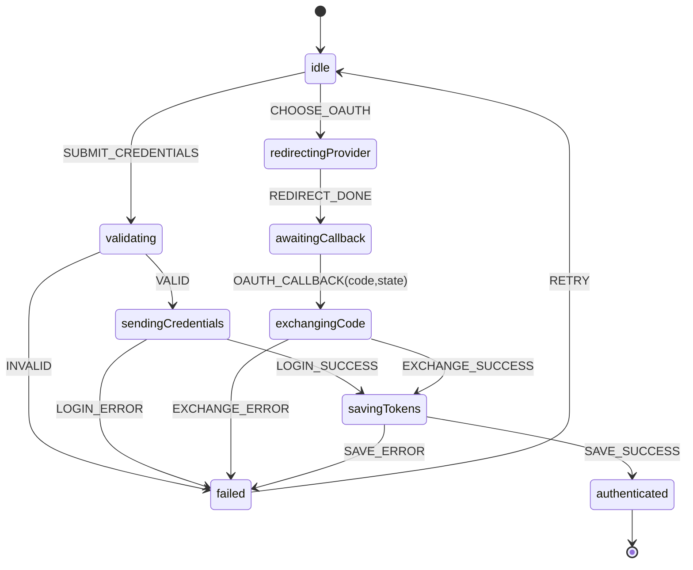

# 登录总流程（凭据 + OAuth）

本文将登录主流程拆分与细化，并提供两种视角：
- Flowchart：步骤编排与分支决策
- State Machine：以 XState 形式表达状态、事件、守卫与服务，更适合实现与测试

## 适用范围
- 凭据登录（邮箱/手机号 + 密码）
- OAuth 登录（以 GitHub 为例）

## Flowchart（Mermaid）
```mermaid
flowchart TD
  A[用户触发登录] --> B{登录方式}
  B -->|凭据| C[SignIn 表单校验]
  C --> D[useFonosterClient.authentication.signIn]
  D --> E[AuthClient.authenticateWithProvider]
  E --> F[WebClient.login]
  F --> G[AuthClient.saveTokensAndUpdateSession]
  G --> H[cookieUtils.saveAuthTokens]
  H --> I[FonosterContext.setSession(true)]
  I --> J[中间件检查]
  J -->|通过| K[/workspace]
  J -->|未验证邮箱/手机号| L[/signup/verify]

  B -->|OAuth| M[跳转 Provider(authUrl + state)]
  M --> N[OAuth 回调解析(code/state)]
  N --> O[authentication.signIn(provider+code)]
  O --> P[WebClient.loginWithOauth2Code]
  P --> G
```

## State Machine（Mermaid）


## XState 参考实现（TypeScript）
```ts
import { createMachine, assign } from 'xstate'

interface Ctx {
  error?: string
}

type Ev =
  | { type: 'SUBMIT_CREDENTIALS'; payload: { identifier: string; password: string } }
  | { type: 'CHOOSE_OAUTH'; provider: 'github' | 'google' }
  | { type: 'VALID' }
  | { type: 'INVALID'; error: string }
  | { type: 'LOGIN_SUCCESS'; tokens: any }
  | { type: 'LOGIN_ERROR'; error: string }
  | { type: 'REDIRECT_DONE' }
  | { type: 'OAUTH_CALLBACK'; code: string; state: string }
  | { type: 'EXCHANGE_SUCCESS'; tokens: any }
  | { type: 'EXCHANGE_ERROR'; error: string }
  | { type: 'SAVE_SUCCESS' }
  | { type: 'SAVE_ERROR'; error: string }
  | { type: 'RETRY' }

export const loginMachine = createMachine<Ctx, Ev>({
  id: 'loginFlow',
  initial: 'idle',
  states: {
    idle: {
      on: {
        SUBMIT_CREDENTIALS: 'validating',
        CHOOSE_OAUTH: 'redirectingProvider'
      }
    },
    validating: {
      on: {
        VALID: 'sendingCredentials',
        INVALID: { target: 'failed', actions: assign({ error: (_, e: any) => e.error }) }
      }
    },
    sendingCredentials: {
      invoke: {
        src: 'sendCredentials',
        onDone: { target: 'savingTokens', actions: 'storeTokensFromLogin' },
        onError: { target: 'failed', actions: assign({ error: (_, e: any) => e.data }) }
      }
    },
    redirectingProvider: {
      entry: 'redirectToProvider',
      on: { REDIRECT_DONE: 'awaitingCallback' }
    },
    awaitingCallback: {
      on: { OAUTH_CALLBACK: 'exchangingCode' }
    },
    exchangingCode: {
      invoke: {
        src: 'exchangeCodeForTokens',
        onDone: { target: 'savingTokens', actions: 'storeTokensFromExchange' },
        onError: { target: 'failed', actions: assign({ error: (_, e: any) => e.data }) }
      }
    },
    savingTokens: {
      invoke: {
        src: 'saveTokensAndSession',
        onDone: 'authenticated',
        onError: { target: 'failed', actions: assign({ error: (_, e: any) => e.data }) }
      }
    },
    authenticated: { type: 'final' },
    failed: {
      on: { RETRY: 'idle' }
    }
  }
})
```

## 集成与代码参考
- 页面入口：`mods/webui/src/pages/signin/index.tsx`
- 客户端调用：`useFonosterClient.authentication.signIn` → `AuthClient` → `WebClient`
- 令牌与会话：`cookieUtils` → `FonosterContext`
- 中间件：`mods/webui/src/middleware.ts`

## 测试建议
- 针对 `validating/sendingCredentials/exchangingCode/savingTokens` 四个关键状态编写单元测试；
- 使用“事件驱动”测试（模拟 `OAUTH_CALLBACK`、`LOGIN_SUCCESS` 等事件），验证状态转移与副作用。