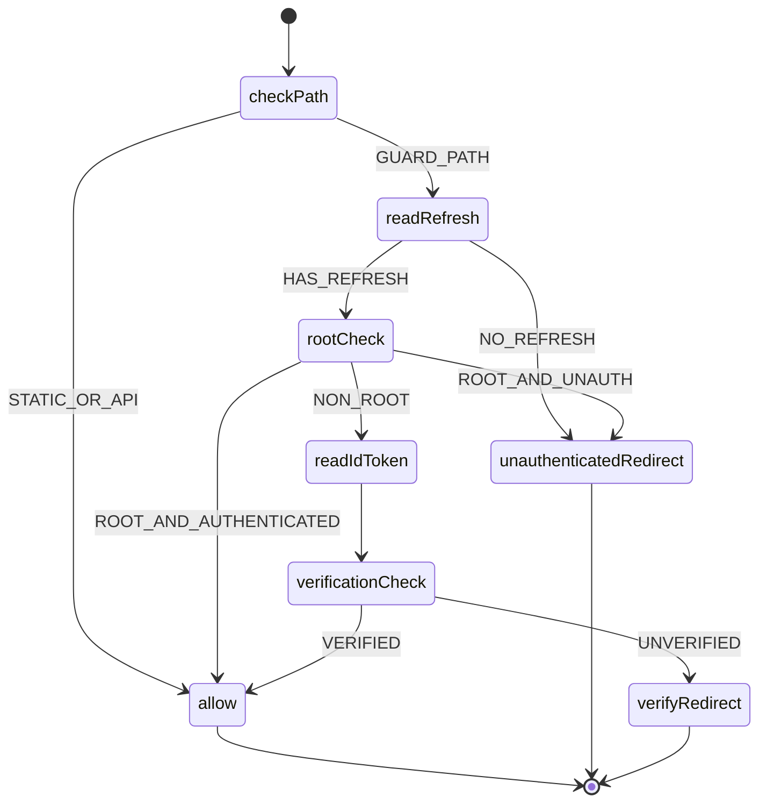

# 路由保护与验证（中间件决策）

本页将中间件的访问控制策略拆分为独立流程与状态机表达，便于实现与调试。

## 适用范围
- `mods/webui/src/middleware.ts` 的决策逻辑
- 根路径重定向、刷新令牌与邮箱/手机号验证的分支

## Flowchart（Mermaid）
```mermaid
flowchart TD
  A[请求进入 middleware] --> B{是否静态/API路径}
  B -->|是| Z[NextResponse.next()]
  B -->|否| C[读取 refreshToken]
  C --> D{refreshToken 是否存在且未过期}
  D -->|否| E[重定向 /signin]
  D -->|是| F{是否根路径 /}
  F -->|是| G{isAuthenticated?}
  G -->|是| H[重定向 /workspace]
  G -->|否| E
  F -->|否| I[读取 idToken]
  I --> J{email/phone 验证？}
  J -->|未验证| K[重定向 /signup/verify]
  J -->|已验证| Z[NextResponse.next()]
```

## State Machine（Mermaid）


## XState 参考实现（TypeScript）
```ts
import { createMachine } from 'xstate'

export const routeGuardMachine = createMachine({
  id: 'routeGuard',
  initial: 'checkPath',
  states: {
    checkPath: {
      always: [
        { target: 'allow', cond: 'isStaticOrApi' },
        { target: 'readRefresh' }
      ]
    },
    readRefresh: {
      always: [
        { target: 'unauthenticatedRedirect', cond: 'noRefreshOrExpired' },
        { target: 'rootCheck' }
      ]
    },
    rootCheck: {
      always: [
        { target: 'allow', cond: 'isRootAndAuthenticated' },
        { target: 'unauthenticatedRedirect', cond: 'isRootAndUnauthenticated' },
        { target: 'readIdToken' }
      ]
    },
    readIdToken: { entry: 'readIdToken', always: 'verificationCheck' },
    verificationCheck: {
      always: [
        { target: 'allow', cond: 'isVerified' },
        { target: 'verifyRedirect' }
      ]
    },
    allow: { type: 'final' },
    unauthenticatedRedirect: { type: 'final' },
    verifyRedirect: { type: 'final' }
  }
}, {
  guards: {
    isStaticOrApi: () => true,
    noRefreshOrExpired: () => false,
    isRootAndAuthenticated: () => false,
    isRootAndUnauthenticated: () => false,
    isVerified: () => true
  }
})
```

## 集成与代码参考
- 中间件：`mods/webui/src/middleware.ts`
- 会话判定：`FonosterContext.isAuthenticated`、`cookieUtils.readAuthTokens`
- 验证状态：`idToken` 字段中的 `email_verified` / `phone_verified`

## 测试建议
- 基于“路径类型”和“令牌状态”的参数化测试覆盖所有分支；
- 使用无副作用的守卫 stub，使状态机测试更纯净。