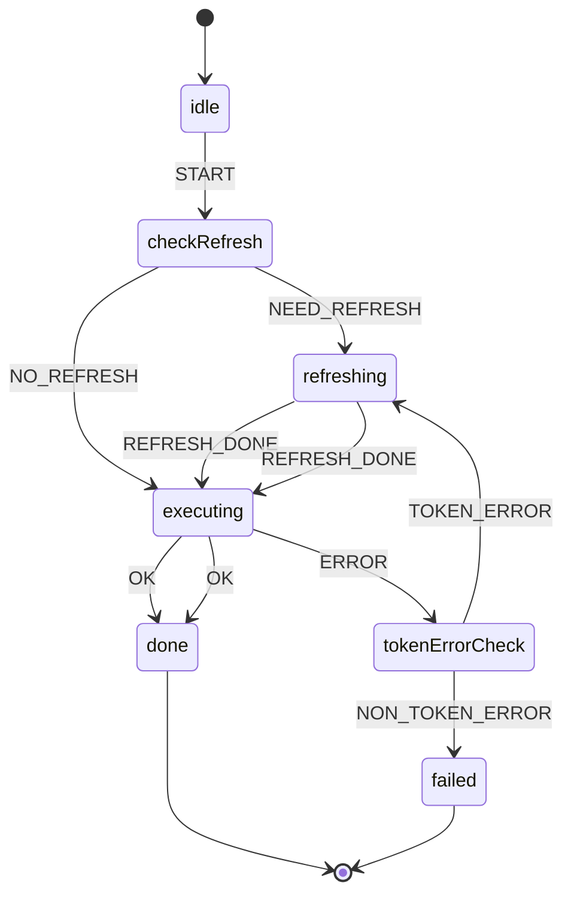

# 令牌刷新与错误重试

将“刷新 + 重试”模式拆分为独立页面，并给出状态机实现参考，利于统一封装与复用。

## 适用范围
- `executeWithRefresh(operation)` 包装器
- `shouldRefreshAccessToken` / `refreshSession` / `isTokenError` 等判定与调用

## Flowchart（Mermaid）
```mermaid
flowchart TD
  A[executeWithRefresh(operation)] --> B{shouldRefreshAccessToken?}
  B -->|是| C[refreshSession()]
  B -->|否| D[执行 operation()]
  C --> D
  D --> E{是否报错}
  E -->|否| F[返回结果]
  E -->|是| G{isTokenError(e)?}
  G -->|是| H[refreshSession()]
  H --> I[重试 operation()]
  I --> F
  G -->|否| J[抛出错误]
  J --> F
```

## State Machine（Mermaid）


## XState 参考实现（TypeScript）
```ts
import { createMachine, assign } from 'xstate'

interface Ctx {
  error?: any
}

type Ev =
  | { type: 'START' }
  | { type: 'NEED_REFRESH' }
  | { type: 'NO_REFRESH' }
  | { type: 'REFRESH_DONE' }
  | { type: 'OK' }
  | { type: 'ERROR'; error: any }
  | { type: 'TOKEN_ERROR' }
  | { type: 'NON_TOKEN_ERROR' }

export const refreshRetryMachine = createMachine<Ctx, Ev>({
  id: 'refreshRetry',
  initial: 'idle',
  states: {
    idle: { on: { START: 'checkRefresh' } },
    checkRefresh: {
      always: [
        { target: 'refreshing', cond: 'shouldRefresh' },
        { target: 'executing' }
      ]
    },
    refreshing: {
      invoke: {
        src: 'refreshSession',
        onDone: 'executing',
        onError: { target: 'failed', actions: assign({ error: (_, e: any) => e.data }) }
      }
    },
    executing: {
      invoke: {
        src: 'executeOperation',
        onDone: 'done',
        onError: { target: 'tokenErrorCheck', actions: assign({ error: (_, e: any) => e.data }) }
      }
    },
    tokenErrorCheck: {
      always: [
        { target: 'refreshing', cond: 'isTokenError' },
        { target: 'failed' }
      ]
    },
    done: { type: 'final' },
    failed: { type: 'final' }
  }
}, {
  guards: {
    shouldRefresh: () => false,
    isTokenError: () => true
  }
})
```

## 集成与代码参考
- 包装器：`useFonosterClient.executeWithRefresh`
- 刷新：`AuthClient.refreshSession`
- 错误判定：`AuthClient.isTokenError`

## 测试建议
- 用可注入的 `executeOperation` 与 `refreshSession` stub 验证分支；
- 覆盖“首次刷新成功 + 二次重试成功/失败”的情形。