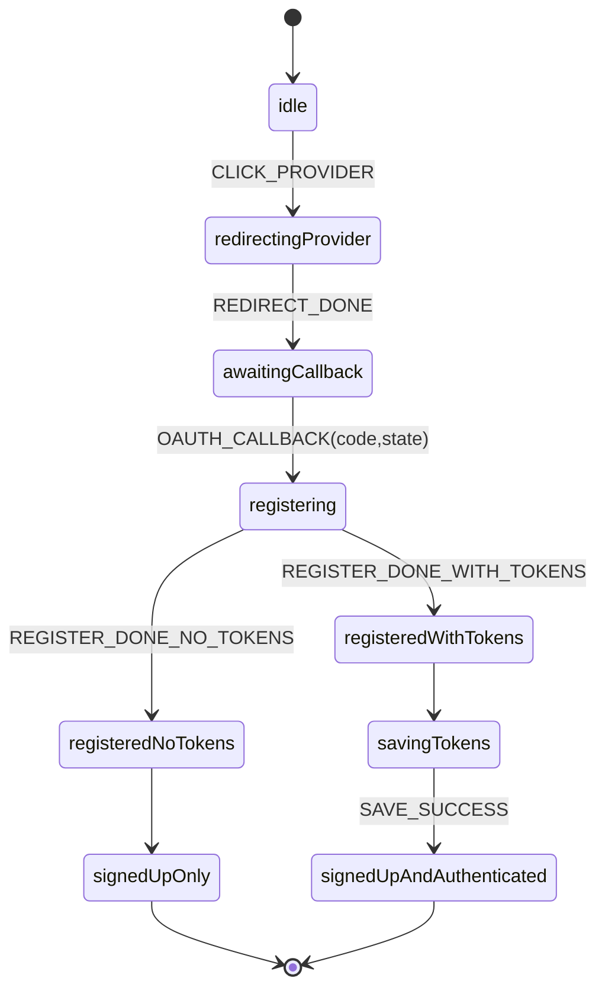

# OAuth 注册流程

将 OAuth 注册流程单列，表达“仅注册与注册后直接登录”两种结果，同时给出状态机示例，便于实现与 E2E 测试。

## 适用范围
- SignUp 页面点击 OAuth Provider 的注册流程
- 回调携带 `code/state` 后的后端注册与可选令牌返回

## Flowchart（Mermaid）
```mermaid
flowchart TD
  A[SignUp 页面点击 Provider] --> B[跳转 authUrl(signup) + state]
  B --> C[回调解析 code/state]
  C --> D[useUser.createUserWithOauth2Code(code)]
  D --> E{后端是否返回令牌}
  E -->|是| F[authentication.handleOAuth2Signup(tokens)]
  F --> G[cookieUtils.saveAuthTokens + setSession(true)]
  E -->|否| H[仅注册成功]
  G --> I[router.replace(SIGNUP_CONFIG.redirectUri)]
  H --> I
```

## State Machine（Mermaid）


## XState 参考实现（TypeScript）
```ts
import { createMachine, assign } from 'xstate'

interface Ctx { error?: string }

type Ev =
  | { type: 'CLICK_PROVIDER' }
  | { type: 'REDIRECT_DONE' }
  | { type: 'OAUTH_CALLBACK'; code: string; state: string }
  | { type: 'REGISTER_DONE_WITH_TOKENS'; tokens: any }
  | { type: 'REGISTER_DONE_NO_TOKENS' }
  | { type: 'SAVE_SUCCESS' }
  | { type: 'ERROR'; error: string }

export const oauthSignupMachine = createMachine<Ctx, Ev>({
  id: 'oauthSignup',
  initial: 'idle',
  states: {
    idle: { on: { CLICK_PROVIDER: 'redirectingProvider' } },
    redirectingProvider: { entry: 'redirectToSignupProvider', on: { REDIRECT_DONE: 'awaitingCallback' } },
    awaitingCallback: { on: { OAUTH_CALLBACK: 'registering' } },
    registering: {
      invoke: {
        src: 'registerWithOauthCode',
        onDone: [
          { target: 'savingTokens', cond: 'returnsTokens', actions: 'storeTokensFromRegister' },
          { target: 'signedUpOnly' }
        ],
        onError: { target: 'signedUpOnly', actions: assign({ error: (_, e: any) => e.data }) }
      }
    },
    savingTokens: {
      invoke: { src: 'saveTokensAndSession', onDone: 'signedUpAndAuthenticated', onError: 'signedUpOnly' }
    },
    signedUpOnly: { type: 'final' },
    signedUpAndAuthenticated: { type: 'final' }
  }
}, {
  guards: { returnsTokens: (_, e: any) => !!e.data?.tokens }
})
```

## 集成与代码参考
- 注册入口：`mods/webui/src/pages/signup/index.tsx`
- 客户端：`useUser.createUserWithOauth2Code` → `authentication.handleOAuth2Signup`
- 令牌与会话：`cookieUtils` → `FonosterContext`

## 测试建议
- 覆盖“注册后返回令牌”与“仅注册成功不返回令牌”两种分支；
- 断言最终路由跳转与会话状态更新是否符合预期。