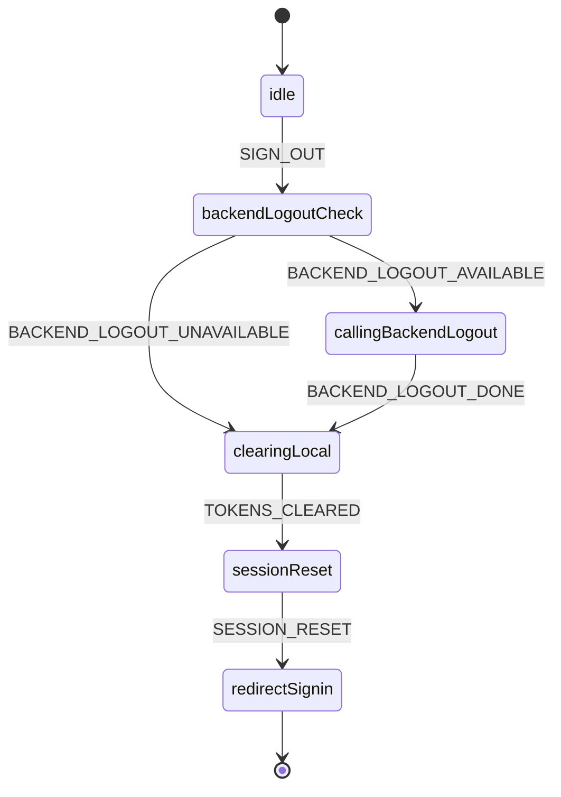

# 登出流程

本页独立描述登出主线，覆盖“后端登出可选”、“本地清理 + 会话重置 + 跳转”的完整路径，并给出状态机示例以提升一致性。

## Flowchart（Mermaid）
```mermaid
flowchart TD
  A[用户触发 signOut] --> B[AuthClient.signOut]
  B --> C{WebClient.logout 存在？}
  C -->|是| D[调用 logout]
  C -->|否| E[跳过]
  D --> F[cookieUtils.clearAuthTokens]
  E --> F
  F --> G[setSession(false)]
  G --> H[跳转 /signin]
```

## State Machine（Mermaid）


## XState 参考实现（TypeScript）
```ts
import { createMachine } from 'xstate'

export const logoutMachine = createMachine({
  id: 'logoutFlow',
  initial: 'idle',
  states: {
    idle: { on: { SIGN_OUT: 'backendLogoutCheck' } },
    backendLogoutCheck: {
      always: [
        { target: 'callingBackendLogout', cond: 'hasBackendLogout' },
        { target: 'clearingLocal' }
      ]
    },
    callingBackendLogout: {
      invoke: { src: 'callBackendLogout', onDone: 'clearingLocal', onError: 'clearingLocal' }
    },
    clearingLocal: {
      entry: 'clearAuthTokens',
      always: 'sessionReset'
    },
    sessionReset: {
      entry: 'setSessionFalse',
      always: 'redirectSignin'
    },
    redirectSignin: { entry: 'redirectToSignin', type: 'final' }
  }
}, {
  guards: { hasBackendLogout: () => true }
})
```

## 集成与代码参考
- 客户端：`useFonosterClient.authentication.signOut` → `AuthClient.signOut`
- 后端登出（可选）：`WebClient.logout`
- 清理与会话：`cookieUtils.clearAuthTokens` → `FonosterContext.setSession(false)`

## 测试建议
- 两个分支：存在/不存在后端登出接口；
- 断言最终跳转与本地状态清理是否完成。